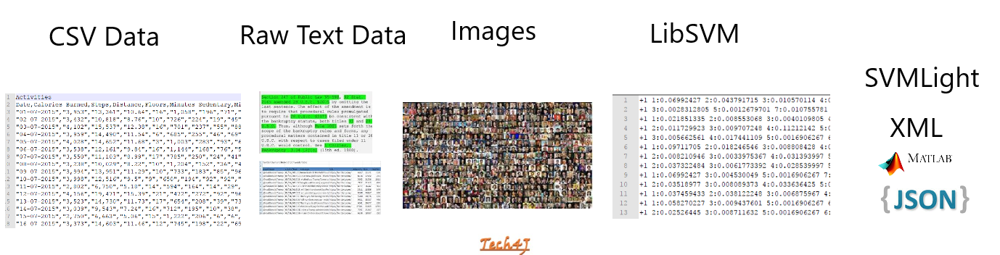
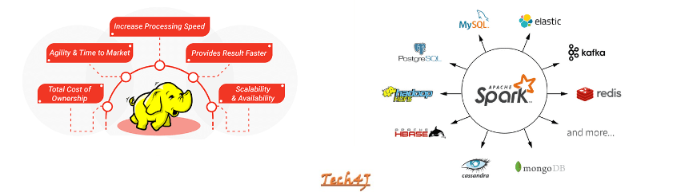

 

  
 
 
Auteur : Silahi Ali Houssene

# DataVec : Vue d'ensemble

* **ETL (Extract Transform Load)**

## Types de données pris en charge par défaut

* **Ecosystème Hadoop**

## Architecture

* **API**
* **Transformations et Filtres**
* **Schéma**
